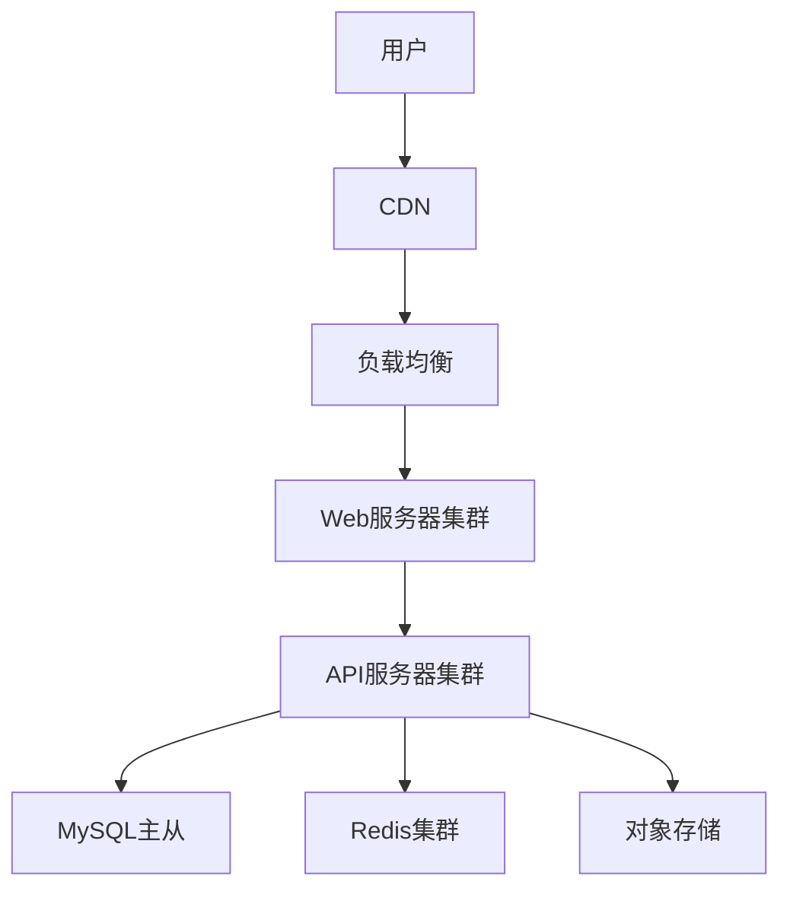
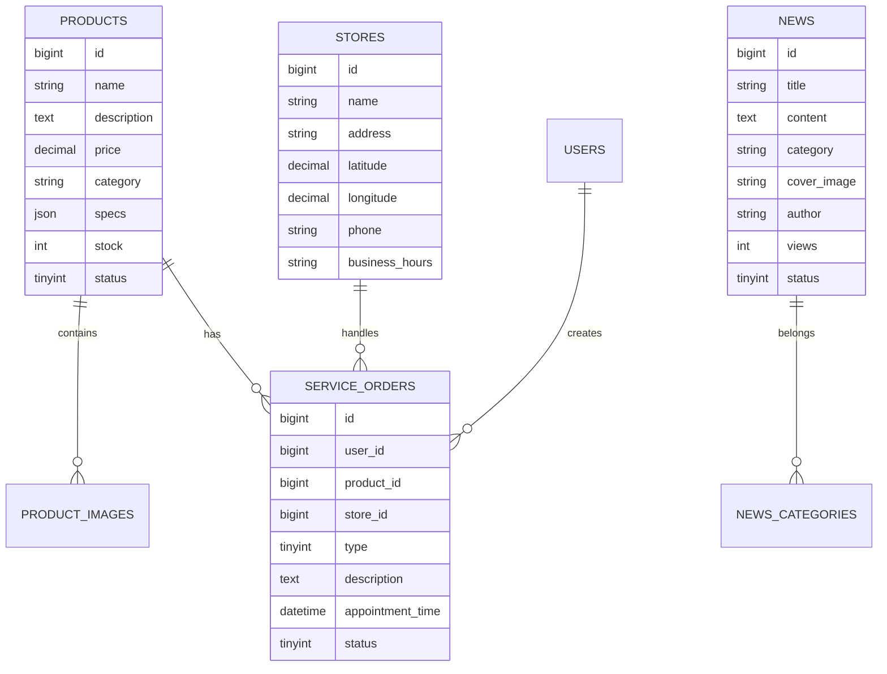
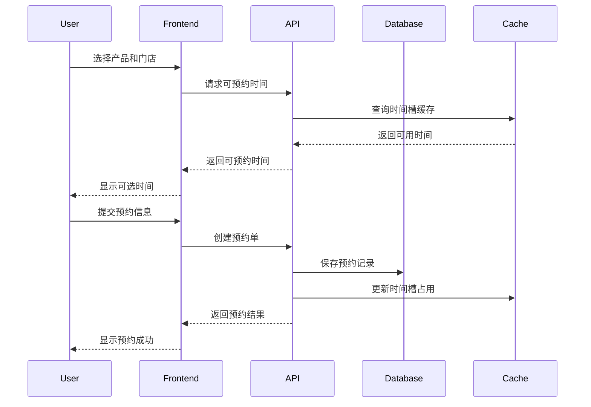

# 手机产品官网系统架构设计

**作者:** 小强  
**最后更新日期:** 2025-04-16  

## 1. 系统架构概述

### 1.1 技术选型
- 前端框架: React + TypeScript
- UI组件库: Ant Design
- 后端框架: Node.js + Express
- 数据库: MySQL
- 缓存: Redis
- 对象存储: AWS S3

### 1.2 系统部署架构


## 2. 数据结构设计

### 2.1 产品管理
```sql
CREATE TABLE `products` (
  `id` bigint NOT NULL AUTO_INCREMENT COMMENT '产品ID',
  `name` varchar(100) NOT NULL COMMENT '产品名称',
  `description` text COMMENT '产品描述',
  `price` decimal(10,2) NOT NULL COMMENT '产品价格',
  `category` varchar(50) NOT NULL COMMENT '产品分类',
  `specs` json COMMENT '产品规格',
  `stock` int NOT NULL DEFAULT '0' COMMENT '库存数量',
  `status` tinyint NOT NULL DEFAULT '1' COMMENT '状态:0-下架,1-上架',
  `created_at` timestamp NOT NULL DEFAULT CURRENT_TIMESTAMP,
  `updated_at` timestamp NOT NULL DEFAULT CURRENT_TIMESTAMP ON UPDATE CURRENT_TIMESTAMP,
  PRIMARY KEY (`id`),
  KEY `idx_category` (`category`)
) ENGINE=InnoDB DEFAULT CHARSET=utf8mb4 COMMENT='产品表';

CREATE TABLE `product_images` (
  `id` bigint NOT NULL AUTO_INCREMENT,
  `product_id` bigint NOT NULL COMMENT '产品ID',
  `image_url` varchar(255) NOT NULL COMMENT '图片URL',
  `type` tinyint NOT NULL COMMENT '图片类型:1-主图,2-详情图',
  `sort` int NOT NULL DEFAULT '0' COMMENT '排序号',
  PRIMARY KEY (`id`),
  KEY `idx_product` (`product_id`)
) ENGINE=InnoDB DEFAULT CHARSET=utf8mb4 COMMENT='产品图片表';
```

### 2.2 门店管理
```sql
CREATE TABLE `stores` (
  `id` bigint NOT NULL AUTO_INCREMENT,
  `name` varchar(100) NOT NULL COMMENT '门店名称',
  `address` varchar(255) NOT NULL COMMENT '详细地址',
  `latitude` decimal(10,7) NOT NULL COMMENT '纬度',
  `longitude` decimal(10,7) NOT NULL COMMENT '经度',
  `phone` varchar(20) NOT NULL COMMENT '联系电话',
  `business_hours` varchar(100) NOT NULL COMMENT '营业时间',
  `status` tinyint NOT NULL DEFAULT '1' COMMENT '状态:0-关闭,1-营业',
  PRIMARY KEY (`id`),
  SPATIAL KEY `idx_location` (`latitude`, `longitude`)
) ENGINE=InnoDB DEFAULT CHARSET=utf8mb4 COMMENT='门店表';
```

### 2.3 售后服务
```sql
CREATE TABLE `service_orders` (
  `id` bigint NOT NULL AUTO_INCREMENT,
  `user_id` bigint NOT NULL COMMENT '用户ID',
  `product_id` bigint NOT NULL COMMENT '产品ID',
  `store_id` bigint NOT NULL COMMENT '门店ID',
  `type` tinyint NOT NULL COMMENT '服务类型:1-维修,2-换新',
  `description` text COMMENT '问题描述',
  `appointment_time` datetime NOT NULL COMMENT '预约时间',
  `status` tinyint NOT NULL COMMENT '状态:0-待处理,1-处理中,2-已完成',
  `created_at` timestamp NOT NULL DEFAULT CURRENT_TIMESTAMP,
  PRIMARY KEY (`id`),
  KEY `idx_user` (`user_id`),
  KEY `idx_product` (`product_id`),
  KEY `idx_store` (`store_id`)
) ENGINE=InnoDB DEFAULT CHARSET=utf8mb4 COMMENT='售后服务单表';
```

### 2.4 新闻资讯
```sql
CREATE TABLE `news` (
  `id` bigint NOT NULL AUTO_INCREMENT,
  `title` varchar(200) NOT NULL COMMENT '新闻标题',
  `content` text NOT NULL COMMENT '新闻内容',
  `category` varchar(50) NOT NULL COMMENT '分类',
  `cover_image` varchar(255) DEFAULT NULL COMMENT '封面图',
  `author` varchar(50) NOT NULL COMMENT '作者',
  `views` int NOT NULL DEFAULT '0' COMMENT '浏览量',
  `status` tinyint NOT NULL DEFAULT '1' COMMENT '状态:0-草稿,1-发布',
  `created_at` timestamp NOT NULL DEFAULT CURRENT_TIMESTAMP,
  PRIMARY KEY (`id`),
  KEY `idx_category` (`category`)
) ENGINE=InnoDB DEFAULT CHARSET=utf8mb4 COMMENT='新闻表';
```

## 3. 实体关系图



## 4. 核心流程时序图

### 4.1 产品预约流程



## 5. 关键接口设计

### 5.1 产品相关接口

#### 5.1.1 获取产品列表
```
GET /api/products

请求参数：
{
  "category": string,  // 产品分类
  "page": number,     // 页码
  "pageSize": number  // 每页数量
}

响应格式：
{
  "code": 0,
  "data": {
    "total": number,
    "items": [{
      "id": number,
      "name": string,
      "description": string,
      "price": number,
      "images": string[]
    }]
  }
}
```

#### 5.1.2 获取产品详情
```
GET /api/products/:id

响应格式：
{
  "code": 0,
  "data": {
    "id": number,
    "name": string,
    "description": string,
    "price": number,
    "specs": object,
    "images": {
      "main": string[],
      "details": string[]
    }
  }
}
```

### 5.2 门店相关接口

#### 5.2.1 查询附近门店
```
GET /api/stores/nearby

请求参数：
{
  "latitude": number,
  "longitude": number,
  "radius": number  // 搜索半径(米)
}

响应格式：
{
  "code": 0,
  "data": [{
    "id": number,
    "name": string,
    "address": string,
    "distance": number,
    "phone": string,
    "businessHours": string
  }]
}
```

### 5.3 售后服务接口

#### 5.3.1 创建服务预约
```
POST /api/services/appointments

请求参数：
{
  "productId": number,
  "storeId": number,
  "type": number,
  "description": string,
  "appointmentTime": string
}

响应格式：
{
  "code": 0,
  "data": {
    "id": number,
    "status": number,
    "appointmentTime": string
  }
}
```

### 5.4 新闻资讯接口

#### 5.4.1 获取新闻列表
```
GET /api/news

请求参数：
{
  "category": string,
  "page": number,
  "pageSize": number
}

响应格式：
{
  "code": 0,
  "data": {
    "total": number,
    "items": [{
      "id": number,
      "title": string,
      "category": string,
      "coverImage": string,
      "author": string,
      "createdAt": string
    }]
  }
}
```