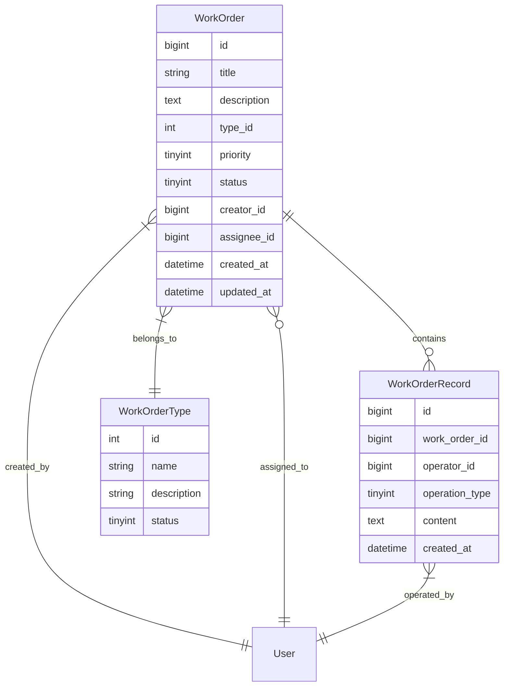
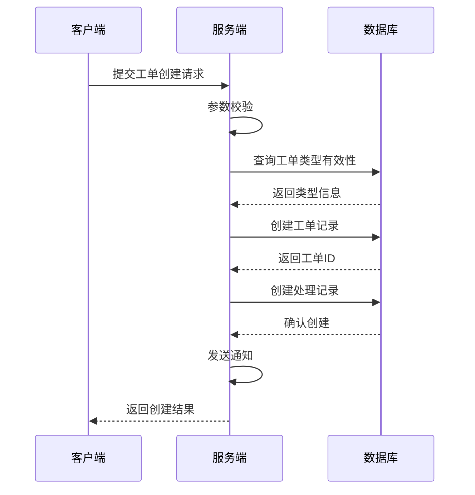
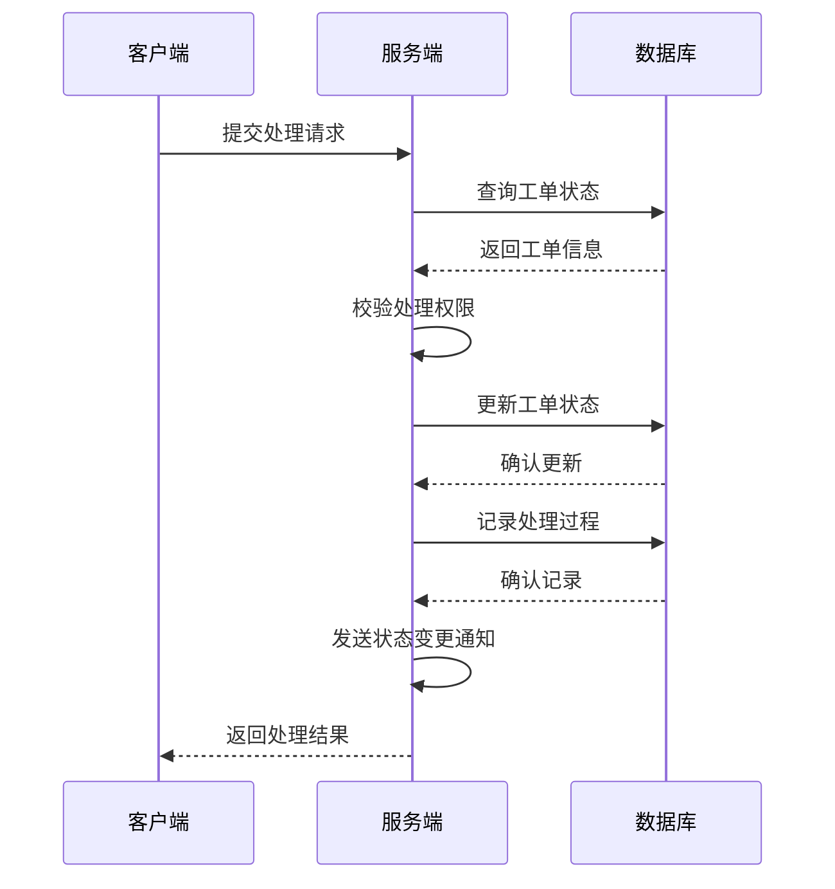

# 智能工单管理系统概要设计文档

| 文档信息 | |
|----------|---|
| 作者 | 小强 |
| 最后更新日期 | 2025-04-15 |
| 文档状态 | 已审核 |

## 1. 数据结构设计

### 1.1 工单主表(work_order)
```sql
CREATE TABLE work_order (
    id BIGINT PRIMARY KEY AUTO_INCREMENT COMMENT '工单ID',
    title VARCHAR(200) NOT NULL COMMENT '工单标题',
    description TEXT COMMENT '问题描述',
    type_id INT NOT NULL COMMENT '工单类型ID',
    priority TINYINT NOT NULL COMMENT '优先级:1低,2中,3高',
    status TINYINT NOT NULL COMMENT '状态:0待处理,1处理中,2已完成,3已关闭',
    creator_id BIGINT NOT NULL COMMENT '创建人ID',
    assignee_id BIGINT COMMENT '处理人ID',
    created_at DATETIME NOT NULL COMMENT '创建时间',
    updated_at DATETIME NOT NULL COMMENT '更新时间',
    expected_finish_time DATETIME COMMENT '期望完成时间',
    actual_finish_time DATETIME COMMENT '实际完成时间',
    INDEX idx_creator (creator_id),
    INDEX idx_assignee (assignee_id),
    INDEX idx_status (status)
) COMMENT '工单主表';
```

### 1.2 工单类型表(work_order_type)
```sql
CREATE TABLE work_order_type (
    id INT PRIMARY KEY AUTO_INCREMENT COMMENT '类型ID',
    name VARCHAR(50) NOT NULL COMMENT '类型名称',
    description VARCHAR(200) COMMENT '类型描述',
    status TINYINT NOT NULL DEFAULT 1 COMMENT '状态:0禁用,1启用',
    created_at DATETIME NOT NULL COMMENT '创建时间',
    updated_at DATETIME NOT NULL COMMENT '更新时间'
) COMMENT '工单类型表';
```

### 1.3 工单处理记录表(work_order_record)
```sql
CREATE TABLE work_order_record (
    id BIGINT PRIMARY KEY AUTO_INCREMENT COMMENT '记录ID',
    work_order_id BIGINT NOT NULL COMMENT '工单ID',
    operator_id BIGINT NOT NULL COMMENT '操作人ID',
    operation_type TINYINT NOT NULL COMMENT '操作类型:1创建,2修改,3转派,4处理,5关闭',
    content TEXT COMMENT '处理内容',
    created_at DATETIME NOT NULL COMMENT '创建时间',
    INDEX idx_work_order (work_order_id)
) COMMENT '工单处理记录表';
```

## 2. 实体关系图



## 3. 核心流程时序图

### 3.1 工单创建流程



### 3.2 工单处理流程



## 4. 关键接口设计

### 4.1 工单创建接口

```
POST /api/v1/workorders

请求体：
{
    "title": "string",        // 工单标题
    "description": "string",  // 问题描述
    "typeId": number,        // 工单类型ID
    "priority": number,      // 优先级
    "expectedFinishTime": "string"  // 期望完成时间
}

响应体：
{
    "code": number,          // 状态码
    "message": "string",     // 提示信息
    "data": {
        "workOrderId": number,  // 工单ID
        "createTime": "string"  // 创建时间
    }
}
```

### 4.2 工单列表查询接口

```
GET /api/v1/workorders

请求参数：
- status: number       // 状态筛选
- priority: number    // 优先级筛选
- typeId: number     // 类型筛选
- keyword: string    // 关键字搜索
- pageNum: number    // 页码
- pageSize: number   // 每页数量

响应体：
{
    "code": number,
    "message": "string",
    "data": {
        "total": number,
        "list": [{
            "id": number,
            "title": "string",
            "status": number,
            "priority": number,
            "createTime": "string",
            "assigneeName": "string"
        }]
    }
}
```

[文档继续包含更多接口定义...]